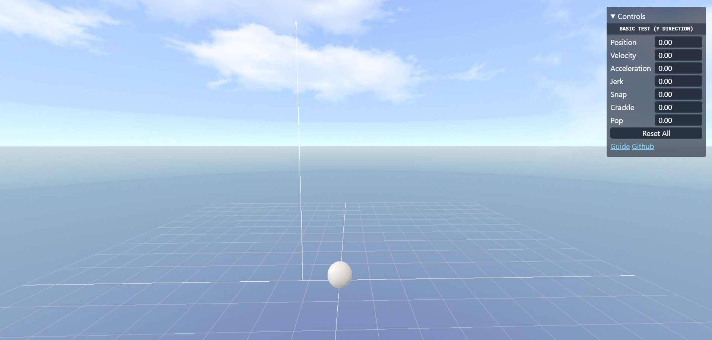

# Physics Sim

A basic physics sim for testing "jerk, snap, crackle, and pop" (higher order derivatives of acceleration) and similar concepts.



The code is a standalone html file with a few cdn links. A server is required to access external images. Install and run:

```bash
pnpm i serve

serve
```

Using threejs and tailwindcss libraries.
